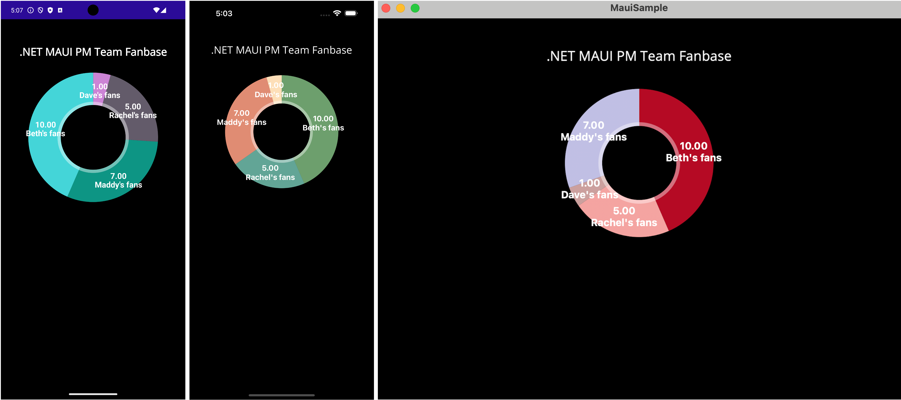

# MauiCharts

MauiCharts is a .NET MAUI binding for creating charts in .NET MAUI apps.

This sample demonstrates the process of creating a binding with a slim API interface (just creates pie charts for now!) using the [CommunityToolkit/Maui.NativeLibraryInterop](https://github.com/CommunityToolkit/Maui.NativeLibraryInterop) template.

As such, MauiCharts binds to the following native libraries:
* [ChartsOrg/Charts](https://github.com/ChartsOrg/Charts) for Mac/iOS
* [PhilJay/MPAndroidChart](https://github.com/PhilJay/MPAndroidChart) for Android

Learn more about Native Library Interop for .NET MAUI at [CommunityToolkit/Maui.NativeLibraryInterop](https://github.com/CommunityToolkit/Maui.NativeLibraryInterop).

